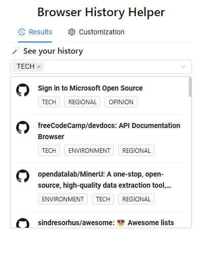
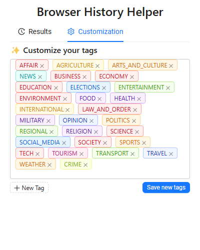

# Browser History Helper - Use AI Techniques to Manage Your History

Browser History Helper is an extension that helps users retrieve webpages from their browser history using Machine Learning models. Specifically, the model can perform semantic similarity searches given a query.

<p align="center">
  
</p>

Additionally, the model generates tags for your history items, allowing you to filter results more effectively.
<p align="center">
  
</p>

We also support customizing tags, enabling users to define their own tag sets to better suit their needs. Currently, we use a distilled BERT uncased model from 🤗 Transformers.
<p align="center">
  
</p>

## TODO
1. **Re-design customization section**
2. **Bug-fix: customized tags section is empty**

## Getting Started

1. **Clone the repository and enter the project directory:**

   ```bash
   git clone https://github.com/ruinanxu/browser-history-helper.git
   cd browser-history-helper/
   ```

2. **Install the necessary dependencies:**

   ```bash
   npm install
   ```

3. **Build the project:**

   ```bash
   npm run build
   ```

4. **Add the extension to your browser:**

   - Go to `chrome://extensions/`
   - Enable developer mode (top right)
   - Click "Load unpacked"
   - Select the `build` directory from the dialog that appears and click "Select Folder"

5. **You're all set!** You should now be able to open the extension's popup and use the model in your browser.